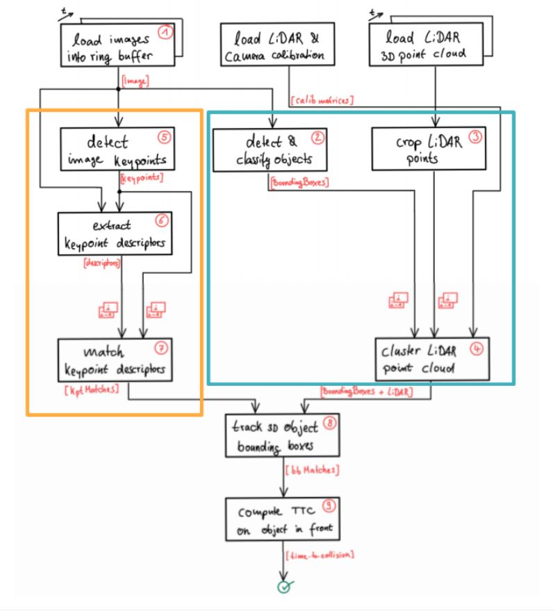
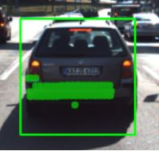
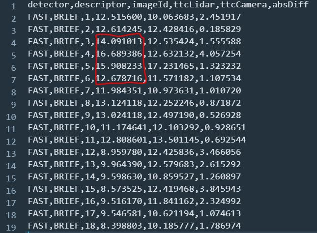

# SFND Collision Detection System

This project combines 2D Image features with 3D Lidar Points to track 3D objects in time in order to get a robust estimate of time-to-collision for the car ahead of the point-of-view car (or the ego car) in each scene. The resulting 3D tracking model allows to estimate TTC using both Camera and Lidar data which could be used to introduce an extra safety factor or redundancy in such Safety critical systems. Various keypoint detectors, descriptors, matching methods have been used for feature tracking , and a pretrained YOLO network is used for Object detection in order to isolate and associating lidar points and image keypoints to preceeding vehicle and track it over frames. It is necessary to implement object tracking in time to be able to compute TTC. KITTI Object tracking highway data sequences have been used in this project. In the end Performance evaluation was done to detect suitable detector/descripter combination and identify situations that could lead to faulty TTC measurements by camera or Lidar and identify shortcomings of individual sensors and how those problems should be addressed using data fusion of these two modalities. 

## Dependencies for Running Locally
* cmake >= 2.8
  * All OSes: [click here for installation instructions](https://cmake.org/install/)
* make >= 4.1 (Linux, Mac), 3.81 (Windows)
  * Linux: make is installed by default on most Linux distros
  * Mac: [install Xcode command line tools to get make](https://developer.apple.com/xcode/features/)
  * Windows: [Click here for installation instructions](http://gnuwin32.sourceforge.net/packages/make.htm)
* Git LFS
  * Weight files are handled using [LFS](https://git-lfs.github.com/)
* OpenCV >= 4.1
  * This must be compiled from source using the `-D OPENCV_ENABLE_NONFREE=ON` cmake flag for testing the SIFT and SURF detectors.
  * The OpenCV 4.1.0 source code can be found [here](https://github.com/opencv/opencv/tree/4.1.0)
* gcc/g++ >= 5.4
  * Linux: gcc / g++ is installed by default on most Linux distros
  * Mac: same deal as make - [install Xcode command line tools](https://developer.apple.com/xcode/features/)
  * Windows: recommend using [MinGW](http://www.mingw.org/)

## Basic Build Instructions

1. Clone this repo.
2. Make a build directory in the top level project directory: `mkdir build && cd build`
3. Compile: `cmake .. && make`
4. Run it: `./3D_object_tracking`.

### Notes on some files & folders

* README.md: this file.
* **./src/**
  * **FinalProject_Camera.cpp** - main file, Implements object tracking and TTC calculation pipeline for highway data sequence and Point Cloud 
  * **camFusion_Student.cpp** & **camFusion.hpp** - Implementation of lidar Camera Fusion , 3D object tracking and TTC calculation.
  * **matching2D.hpp** & **matching2D_Student** - Implementation of Keypoint detection and matching. 
  * **LidarData.hpp** & **LidarData.cpp** - Routines for Loading ,Filtering and visualising Lidar Data.
    **ObjectDetection2D.cpp**- Integration of Yolo Object detection framework in the project.
    **dataStructures.h**- Defines Key data structures for describing Lidar Point cloud , Sensor Data Frames and 3D Bounding Boxes.   
  * **** - contains point-cloud-data files and functions for use with synthetic data.

## Performance Evaluation and Observations

1. Estimating TTC with lidar is prone to errors because of outliers. But this can be reduced by incorporating some filtering method where instead of chosing the closes point (with respect to x coordinate) from the vehicle either mean of all the points or median of the points or 25th percentile etc. is considered for calculation. In the current implementation median is used and it does a good job in reducing the outlier effect. However TTC incresase suddenly in one of the frames before it returns to plausible value. This is because of the Lidar reflections from Rear view mirror inside preceeding vehicle which skews the median value too much. These points will have to be explicity removed using advanced point cloud filtering techniques.

2. Estimating TTC with camera higly depends on robustness in detecting and matching keypoints. If keypoint detection or matching based on descriptors is off TTC calculations would be drastically off. This can be seen in experiments with HARRIS and ORB detectors where some of the values are NANs and some values are -inf. With other detectors - BRISK, AKAZE, SHITOMASI and SIFT, calculations doesn't appear too erratic but they jump very discretlty between frames. The resulting performance evaluation data is saved in the results folder. Among all the descriptors, FAST detector combined with all the descriptors seems to be giving better results as TTC values doesn't vary over frames. Also Lidar and Camera TTC values are pretty close to each other. 

**Conclusion:** TTC from lidar measurements can be erratic due to outliers but aplying filtering techniques on them would provide better results. While calculatin TTC from camera alone, choise of detector and descriptor is very important. From above experiments FAST-BRIEF pair can be recommended based on relative smooth TTC values over the multiple frames. 
